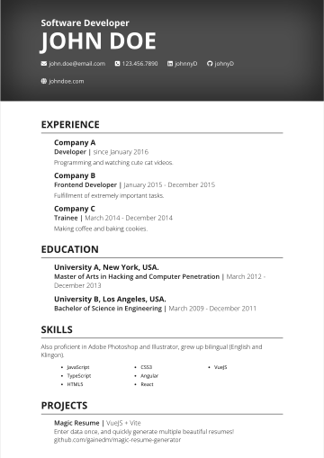
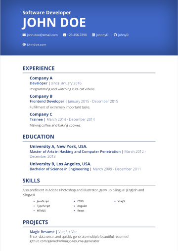
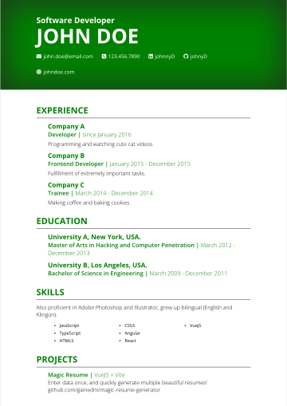
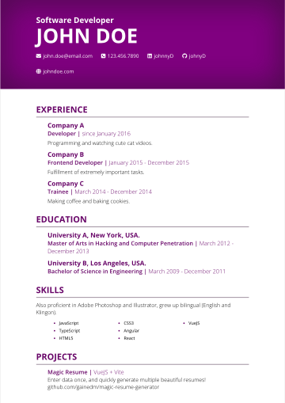
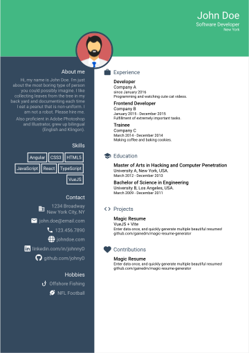
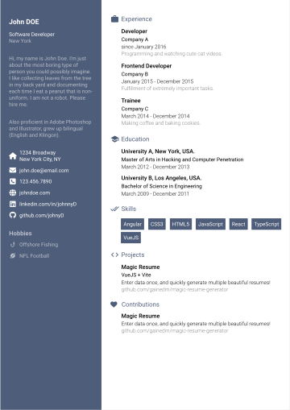
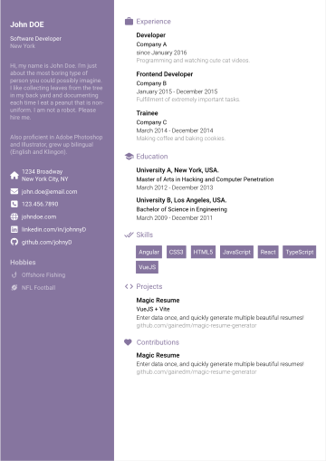
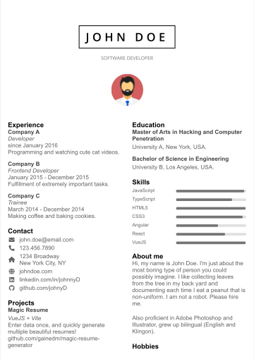
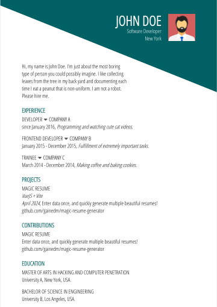

<div style="text-align:center">
  <h1>Magic Resume Generator</h1>
  <p>Enter data once, and quickly generate multiple beautiful resumes!</p>
  <p>Made with Vue 3 + Vite and Less</p>
</div>

<h2>Available Templates</h2>
<h3>Base</h3>
<p>





</p>
<h3>Cool</h3>
<p>



</p>
<h3>Creative</h3>
<p>




</p>
<h3>Left Right</h3>
<p>

</p>
<h3>Material Dark</h3>
<p>


</p>
<h3>Oblique</h3>
<p>



</p>
<h3>Professional</h3>
<p>

</p>
<h3>Side Bar</h3>
<p>

</p>

## Prerequisite

1. [Node](https://nodejs.org/en/) (latest)
2. [NPM](https://www.npmjs.com/) (latest)

## How to use

1. Clone the repository.

   ```
   git clone https://github.com/gainedm/magic-resume-generator.git
   ```

2. Go to the project directory.

   ```
   cd magic-resume-generator
   ```

3. Install the project.

   ```
   npm i
   ```

4. Customize your data:
   1. Option 1 - Update your data locally:
      1. Update `data/data.yml` directly with your information.
      2. Add your profile picture to the `public/assets/pictures/` directory and update the `picture` value in `data.yml` to match the file name.
   2. Option 2 - Host your data remotely:
      1. Make a copy of `.env.example` and rename to `.env`.
      2. Update the `VITE_DATA_URL` value to a fully qualified url that returns your data in json format.
      3. In this case, the `picture` value should also be a fully qualified url.

5. Preview resumes with `npm run dev`. Navigate to http://localhost:5173 in your browser to see thumbnails. Click a thumbnail to see a full-page preview.

6. Export resumes with `npm run export`. You can also export a single resume using `npm run export --template=template-name`. All resumes will be exported to the `public/assets/pdf/` folder.

## Creating and Updating Templates

Please read the [developer documentation](DEVELOPER.md) for instructions on creating and updating templates.

## Contribute

Feel free to open a pull request to add new templates, language supports, fix bugs, or improve the documentation.

## Credits

> Originally based on the [best-resume-ever](https://github.com/salomonelli/best-resume-ever) project by [@salomonelli](https://github.com/salomonelli). I also ported some templates from [best-resume-ever](https://github.com/noDojo/best-resume-ever) by [@noDojo](https://github.com/nodojo).

This project uses several open source packages:

- <a href="https://github.com/vuejs/core" target="_blank">Vue 3</a>
- <a href="https://github.com/vitejs/" target="_blank">Vite</a>
- <a href="https://github.com/GoogleChrome/puppeteer" target="_blank">Puppeteer</a>
- <a href="https://github.com/less/less.js" target="_blank">Less</a>

---

> GitHub [@gainedm](https://github.com/gainedm)

## License

[MIT](https://github.com/gainedm/magic-resume-generator?tab=License-1-ov-file)
